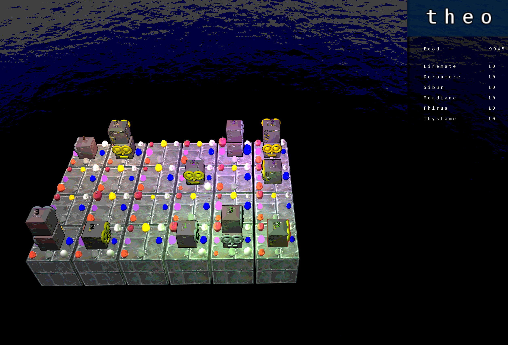
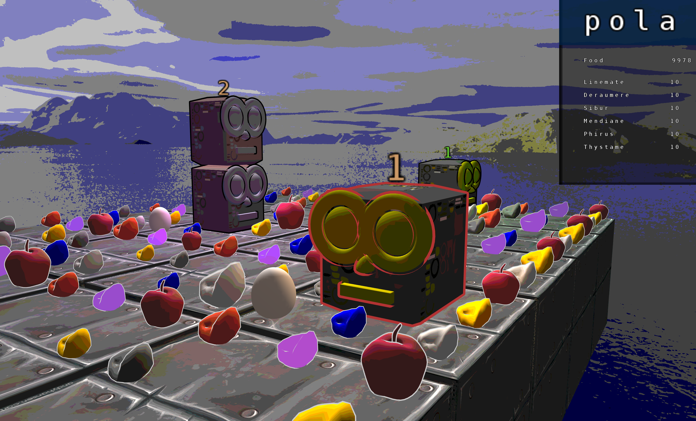
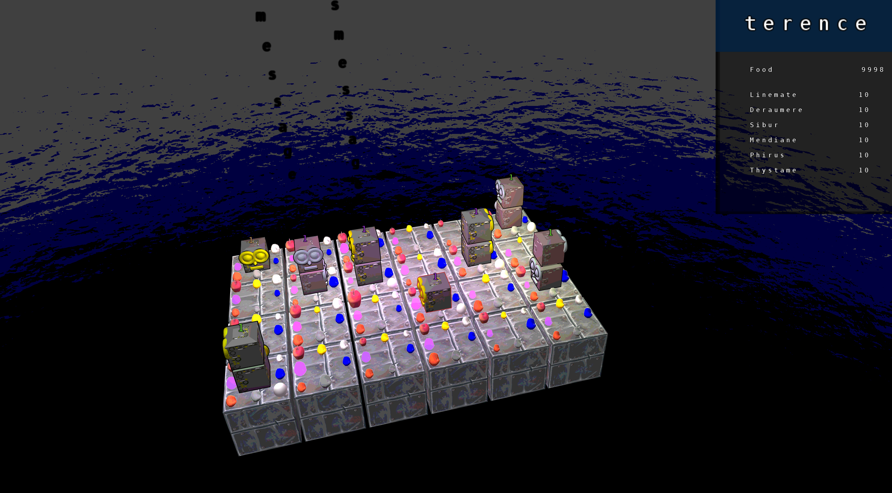
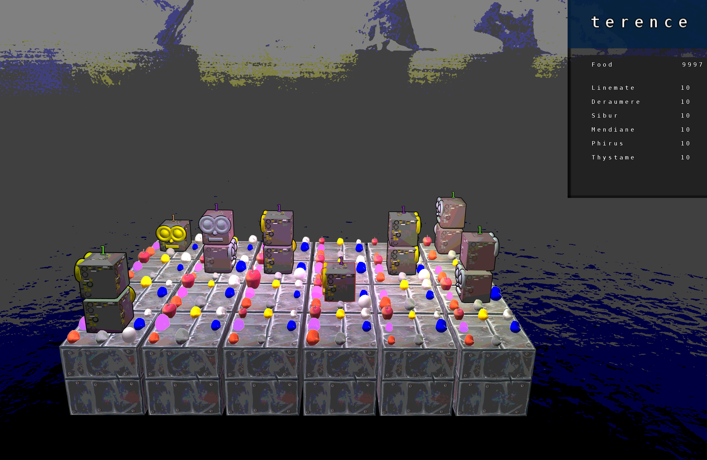

# Zappy 🎮🎲

This project is about implementing a multi-players game with artifical intelligence players and a graphical interface.
The players and the graphical clients connect to the server through TCP/IP.
The event-driven server utilizes a single thread within a single process.

 

 

 

 

  

## Rules:
* each player starts with 10 food (1260 time units) and 0 stones,
* each player starts on level 1,
* the higher level, the more in sight,
* one food == 126 time units,
* eat to not starve, collect stones to level up,
* hatch an egg if you need a spot in your family,
* create family of (at least) 6 and win the game.
  

## Commands

Each player is allowed to use following commands:

| Command | Time | Description |
|:-:|:-:|:-:|
| advance | 7 | advance one square |
| left | 7 | turn 90 degrees left |
| right | 7 | turn 90 degrees right |
| see | 7 | see what's in your sight |
| inventory | 1 | look into your inventory |
| take <object> | 7 | take an object to your inventory |
| put <object> | 7 | drop an object from your inventory |
| kick | 7 | kick the players form your square |
| broadcast <text> | 7 | send a message to all players |
| incantation | 300 | begin the ritual of incantation |
| fork | 42 | lay an agg and create additional spot in a family |
| connect_nbr | 0 | number of unused connection within a family |
 
  
  
## Incantation
In order to win you and your family member have to achieve level 8 (at least 6 family members) by collection stones and having an incantation ritual. These stones have 6 distinct kinds: linemate, deramere, sibur, mendiane, phiras and thystame.
Each level has different ritual requirements:

| Level | Number of players | Linemate | Deraumere | Sibur | Mendiane | Phiras | Thystame |
|:-:|:-:|:-:|:-:|:-:|:-:|:-:|:-:|
| 1-2 | 1 | 1 | 0 | 0 | 0 | 0 | 0 |
| 2-3 | 2 | 1 | 1 | 1 | 0 | 0 | 0 |
| 3-4 | 2 | 2 | 0 | 1 | 0 | 2 | 0 |
| 4-5 | 4 | 1 | 1 | 2 | 0 | 1 | 0 |
| 5-6 | 4 | 1 | 2 | 1 | 3 | 0 | 0 |
| 6-7 | 6 | 1 | 2 | 3 | 0 | 1 | 0 |
| 7-8 | 6 | 2 | 2 | 2 | 2 | 2 | 1 |

 

